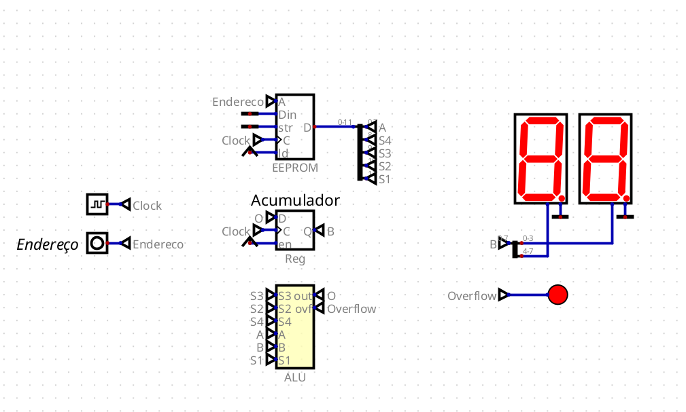

# Ativiade Ponderada

## CPU

### [Vídeo com a explicação do funcionamento.](https://drive.google.com/file/d/1uZD9pwe5EbWQOKrC39uehs96r81KcLnn/view?usp=sharing)

&nbsp;&nbsp;&nbsp;&nbsp;Para esta atividade, foi desenvolvida uma CPU simples utilizando a ferramenta [Digital](https://github.com/hneemann/Digital), com o objetivo de compreender e aplicar conceitos fundamentais de arquitetura de computadores. O projeto contempla os principais componentes de uma CPU, como a Unidade Lógica e Aritmética (ALU), registradores e memória. 

### Ferramentas

- [Digital](https://github.com/hneemann/Digital).

### Entrega

#### Vídeo

&nbsp;&nbsp;&nbsp;&nbsp;O vídeo disponível no [link](https://drive.google.com/file/d/1uZD9pwe5EbWQOKrC39uehs96r81KcLnn/view?usp=sharing) contém a demonstração do funcionamento da CPU e uma explicação de como ela foi elaborada.

#### Arquivos

##### CPU

&nbsp;&nbsp;&nbsp;&nbsp;A [CPU](./circuitos/CPU.dig) integra a ALU, um registrador e uma memória EEPROM. Ela é capaz de executar operações aritméticas, lógicas e de deslocamento.

##### ALU

&nbsp;&nbsp;&nbsp;&nbsp; A [ALU](./circuitos/ALU.dig) é responsável pelas operações aritméticas e lógicas dentro da CPU. Ela inclui os seguintes módulos: somador de 8 bits, subtrator de 8 bits, multiplicador de 4 bits, operações de shift (direita e esquerda), AND, OR e XOR. 

